# Звіт з лабораторної роботи №10

## 60 балів

### 1. Підготовка репозиторію та локальний запуск

Вивід http://localhost:8080/api/status:

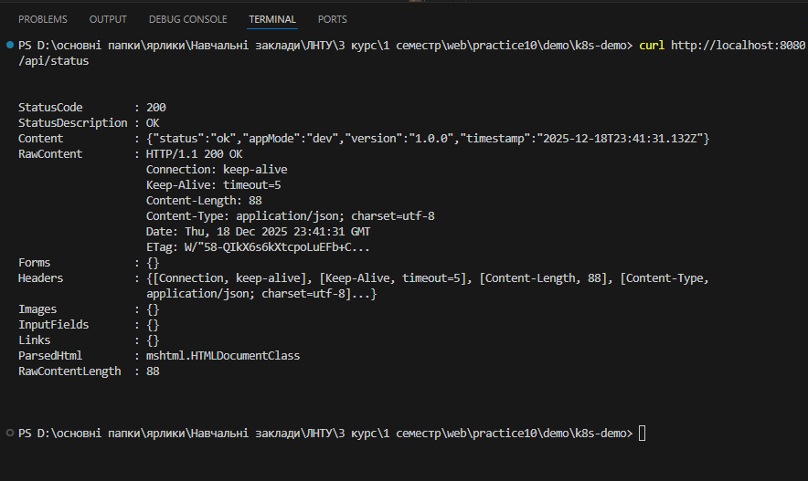

Вивід http://localhost:8080/api/items?filter=a:

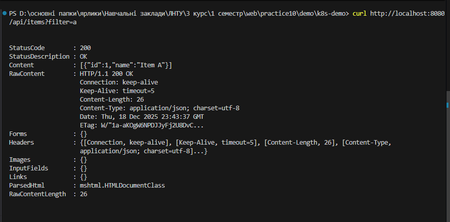

Вивід http://localhost:8080/api/slow:

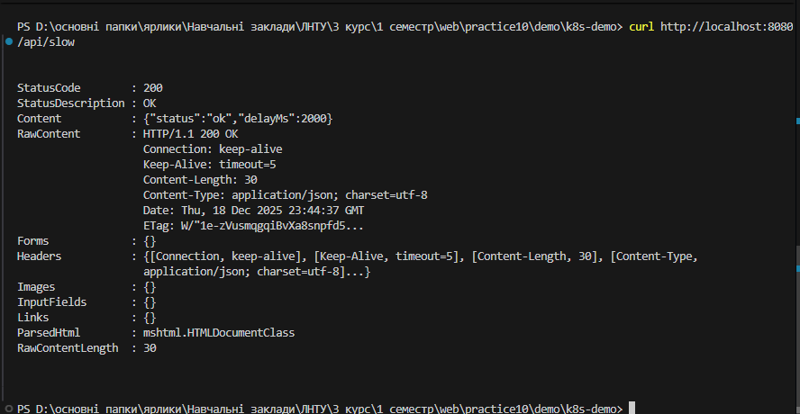

Вивід http://localhost:8080/api/error:

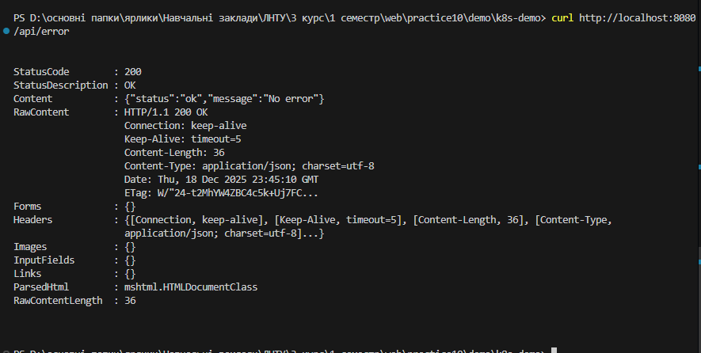

Вивід http://localhost:8080/healthz:

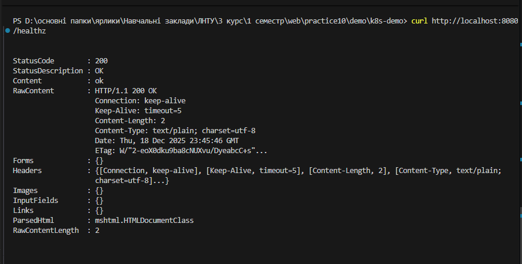

Вивід http://localhost:8080/ready:

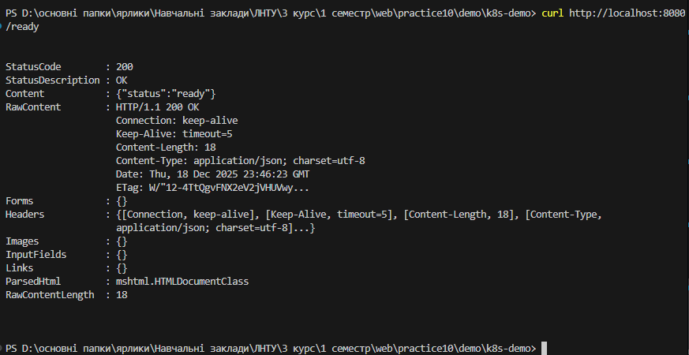


### 2. Контейнеризація застосунку

Команда збірки образу:

```
docker build -t k8s-demo-app:1.0.0 .

```

Команда запуску контейнера

```
docker run --rm -p 8080:8080 -e SECRET_TOKEN=local k8s-demo-app:1.0.0

```
Вивід curl http://localhost:8080/api/status із зібраного образу: 

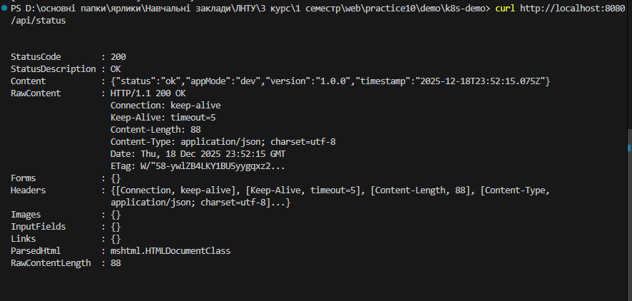

### 3. Запуск Minikube та перевірка кластера

Отримання контексту minikube: 

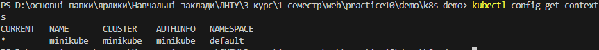

Вивід поточного контексту minikube:

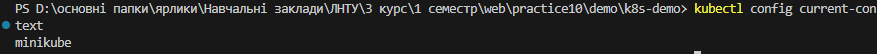

Отримання нодів: 

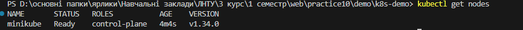

### 4. Розгортання Namespace, ConfigMap, Secret, Deployment, Service

Перевірка ресурсів:

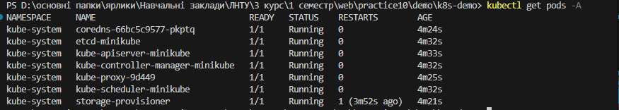

### 5. Доступ до сервісу через Service та kubectl port-forward

Перевірка ендпоінту http://localhost:8080/api/status після port-forward:

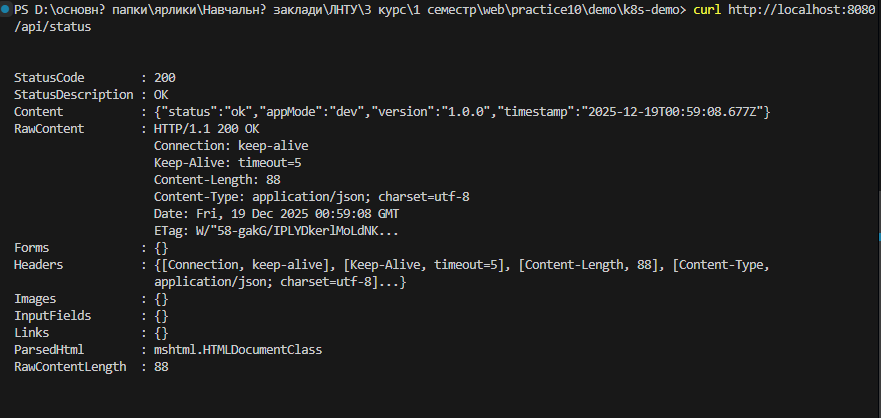

Перевірка ендпоінту http://localhost:8080/api/items після port-forward:

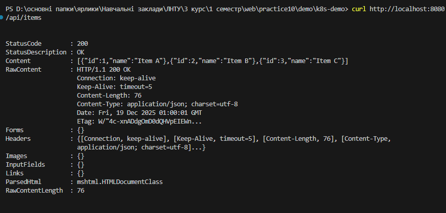

## 75 балів

### 1. Робота з ConfigMap: зміна APP_MODE


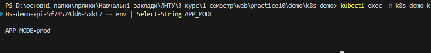

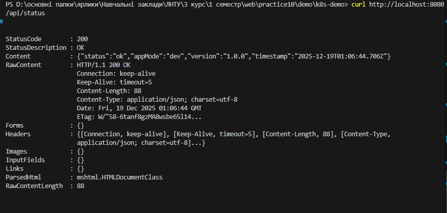

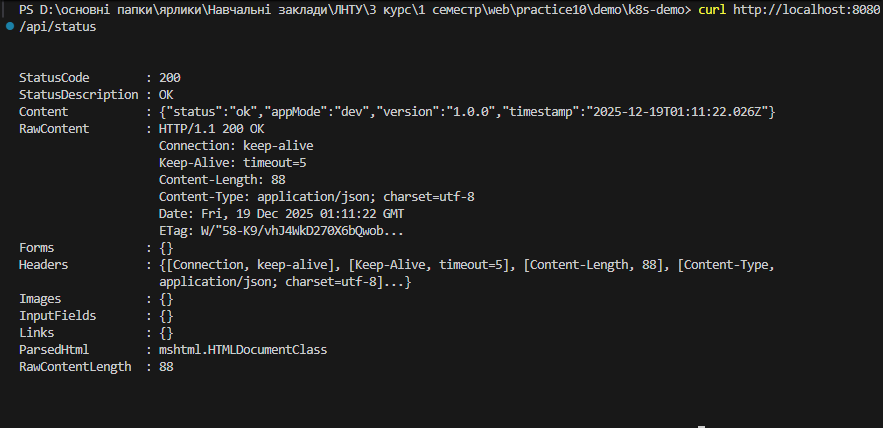

### 2. Демонстрація ефекту зміни ConfigMap без рестарту pod-ів

Значення APP_MODE не змінилося, тому що ConfigMap не було підтягнуто до minikube

Еnv-змінні потрапляють усередину контейнера після перезапуску Deployment

### 3. Перезапуск Deployment та підтвердження оновленої конфігурації

### 4. Аналіз health-checkів (liveness та readiness)

`kubectl rollout restart` перезапускає поди Deployment, щоб застосунок зчитав оновлені env-змінні, оскільки вони не оновлюються в уже запущених контейнерах.

Рекомендований підхід — оновлювати ConfigMap і ініціювати перезапуск подів (наприклад, через `kubectl rollout restart` або версіонування ConfigMap), щоб нова конфігурація гарантовано застосувалась.


## 90 балів

### 1. Налаштування Ingress та доступ через k8s-demo.local

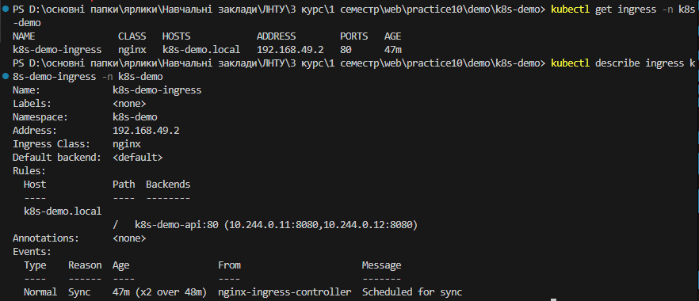

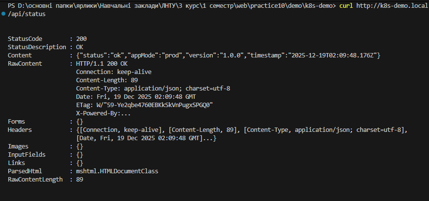

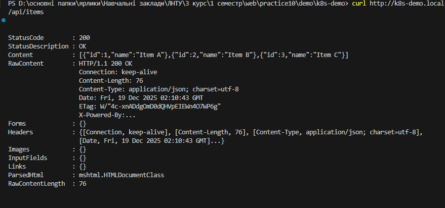

### 2. Debug-флоу: pod-и, Service, Ingress

Базові команди для діагностики доступу до сервісу:

`kubectl get pods`,

`kubectl describe service`,

`kubectl describe ingress`,

`kubectl logs pod`,

`kubectl get endpoints`.


`kubectl get pods` показує стан і готовність подів;

`kubectl describe service` відображає тип сервісу, порти та селектори;

`kubectl describe ingress` показує правила маршрутизації та статус Ingress-контролера;

`kubectl logs pod` дозволяє перевірити, чи працює застосунок усередині пода;

`kubectl get endpoints` показує, до яких подів фактично маршрутизується трафік сервісу.


### 3. Демонстрація самовідновлення pod-ів

Процес самовідновлення pod`ів:

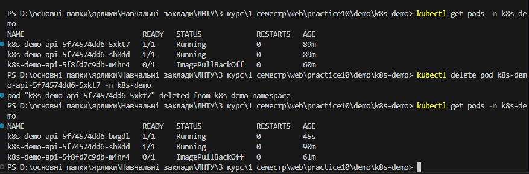

## 100 балів

### 1. Вибір власного сервісу

Обраний сервіс:
[Defence Industrie Website](https://github.com/rxniray/Defense-Industry-Website)


### 2. Контейнеризація власного сервісу

Запуск образу

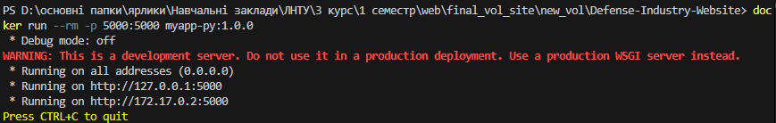

Перевірка ендпоінту /products


### 3. Deployment і Service для власного сервісу

Встановлення port-forvard:

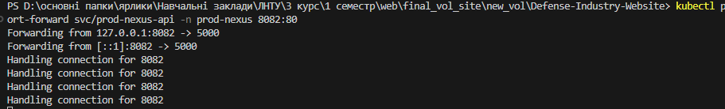

Перевірка через port-forvard:


## Контрольні запитання

1. **Відмінність між ConfigMap та Secret:**
   ConfigMap зберігає неконфіденційні налаштування у відкритому вигляді, тоді як Secret призначений для чутливих даних (паролі, токени) і зберігає їх у закодованому вигляді з обмеженим доступом.

2. **Відмінність між liveness- та readiness-перевірками:**
   Liveness-перевірка визначає, чи контейнер «живий» і потребує перезапуску, а readiness-перевірка визначає, чи контейнер готовий приймати трафік.

3. **Через які ресурси проходить запит:**

    3.1. **Через `kubectl port-forward`:** запит проходить від локальної машини → `kubectl` → Kubernetes API Server → безпосередньо до Pod.
    3.2. **Через `http://k8s-demo.local`:** запит проходить через DNS → Ingress Controller → Ingress → Service → Pod.

4. **Рекомендований підхід до оновлення конфігурації через env-змінні з ConfigMap:**
Рекомендується оновлювати ConfigMap і виконувати перезапуск подів (наприклад, через `kubectl rollout restart` або версіонування ConfigMap), щоб нові env-змінні були застосовані.

5. **Як було мігровано власний сервіс у Kubernetes і які відмінності від демо k8s-demo.**

    До проєкту було додано `deployment.yaml`, `service.yaml` та `namespace.yaml`, після чого було зібрано образ в Docker. Наступним кроком було підключення Minikube до контейнера. Наступними етапами були проведені тестування.

    На відміну від k8s-demo, наш сервіс виконано на фреймворку Flask та відсутні файли `configmap.yaml` та `secret.yaml`
