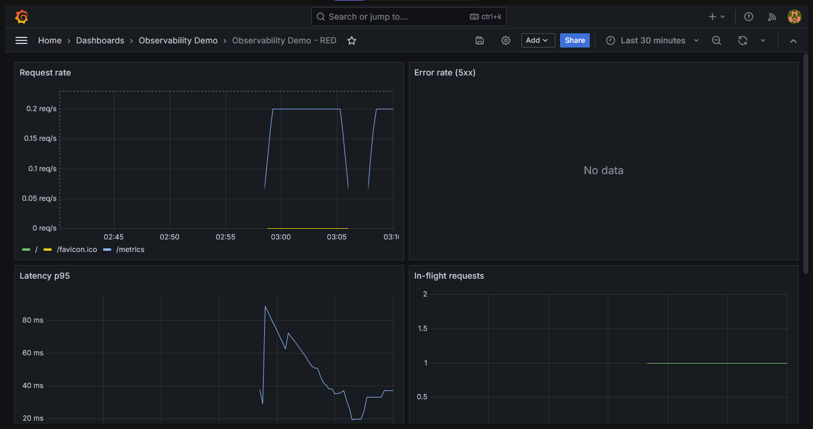
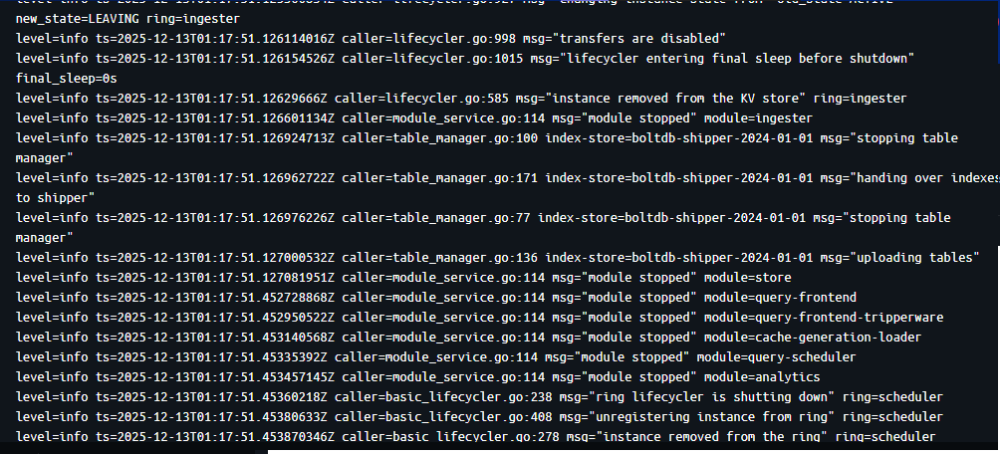
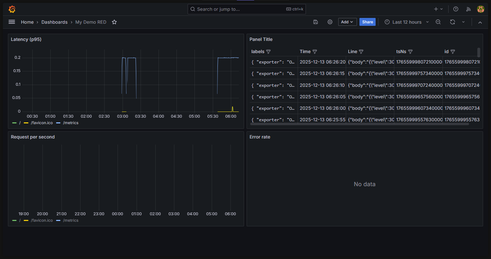

# Звіт з лабораторної роботи №8

## 1. Запуск на тестовому стенді

### Дашбоард тестового стенду Grafana

### Скріншот логу з Loki

## 2. Створення власного RED-дашборду

### Скріншот дашборду

Посилання на JSON-файл: [тиць](./My_Demo_RED.json)